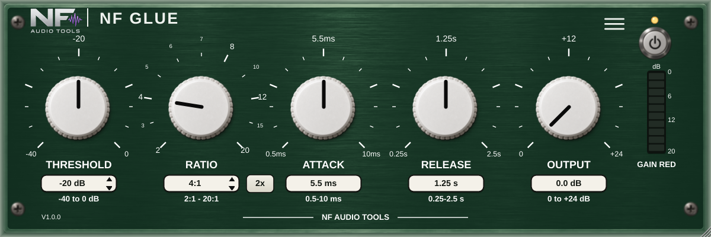

# NF Glue

Compressor plug-in by **NF Audio Tools** (Nenno Fernando). VST3, AU (macOS) and AAX (Pro Tools).

Controls: **Threshold** (−40..0 dB), **Ratio** (2..20 :1) + **2x**, **Attack** (0.5–10 ms), **Release** (0.25–2.5 s),
**Output** (0..+24 dB makeup), **Gain Red** meter, Power, 15 factory presets + save/load.



## Build (local, no CI)
- macOS DMG (VST3 + AU + PACE-signed AAX): `bash Installer/macos/build_dmg.sh`
- Windows installer (VST3 + PACE-signed AAX): `.\Installer\Windows\build_windows_installer.ps1`

See `CLAUDE.md` for the rules (version, AAX SDK, signing).

## Tests
```
g++ -std=c++17 -Wall -Wextra Tests/CompressorTests.cpp -o dsp_tests && ./dsp_tests
```

Opens at 810 x 270 and remembers the size you choose with the resize handle; double-click the NF logo to go back to the default. A small preset tab (prev / name / next) sits at the top right; the 3-line button holds About.
